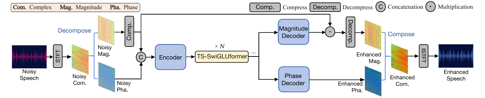
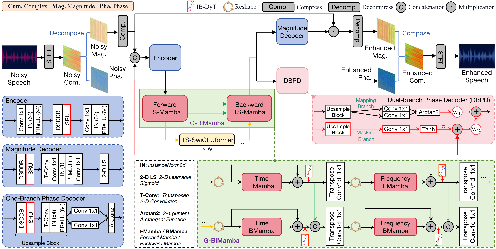
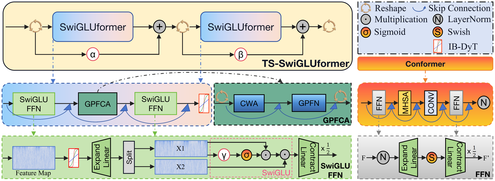
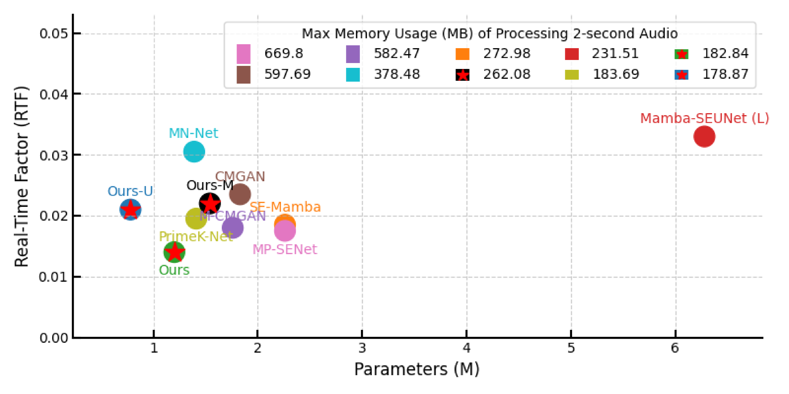

[English](README.md) | **中文**

# DyTSwiG-Mamba: 基于双分支相位预测的无层归一化 CNN-Mamba 语音增强网络 (TASLP 审稿中)

作者：Yujie Xiong, Zhihua Huang, Bixin Wu

**摘要：** 基于多个堆叠的 Two-Stage (TS) 块的语音增强 (SE) 模型取得了令人瞩目的性能。然而，它们在每个 TS 块内面临性能与效率之间的根本性折衷，同时由于层归一化的广泛使用，数据适应性有限。此外，被广泛采用的相位解码器往往忽略带噪相位条件，导致噪声鲁棒性欠佳。为此，我们提出了两个无层归一化的单通道 SE 网络：**DyTSwiG-Net** 和 **DyTSwiG-Mamba**。首先，我们引入了 SwiGLUformer 作为 TS 块更高效的替代方案，并设计了 Input-Biased Dynamic Tanh (IB-DyT) 激活函数以支持无层归一化架构。对于 DyTSwiG-Mamba，我们进一步设计了双分支相位解码器 (DBPD)，通过加入带噪相位谱来联合估计相位映射和相位掩蔽，并集成了全局双向 Mamba (G-BiMamba) 模块以增强网络中的特征聚合能力。我们在英文和中文共四个数据集上对两个模型进行了全面评估。消融实验和可视化分析验证了 SwiGLUformer 和 DBPD 的有效性。实验结果表明，DyTSwiG-Net 在保持有竞争力性能的同时实现了更快的推理速度。值得注意的是，DyTSwiG-Mamba 在公开数据集上超越了 SOTA 模型，同时节省了约 25% 的整体成本。此外，所提出的 IB-DyT 可以无缝集成到多种架构中，在跨数据集评估中显著提升了性能。一些方法在中文语音和低信噪比场景下效果不一，而我们的模型展现出了卓越的性能和噪声鲁棒性。

## 环境要求
1. Python >= 3.9
2. 克隆本仓库
3. 安装 Python 依赖，请参考 [requirements.txt](https://github.com/Yj-Xiong/DyTSwiG-SE/blob/main/DyTSwiG-SE-Main/requirements.txt)
4. 下载并解压 [VoiceBank+DEMAND 数据集](https://datashare.ed.ac.uk/handle/10283/1942)
5. 将干净和带噪的 wav 文件分别移动到 `VoiceBank+DEMAND/wavs_clean` 和 `VoiceBank+DEMAND/wavs_noisy`（或自定义路径），并相应修改 [train.py](https://github.com/Yj-Xiong/DyTSwiG-SE/blob/main/DyTSwiG-SE-Main/train.py) 中的路径参数 `--input_clean_wavs_dir` 和 `--input_noisy_wavs_dir`

## 训练
在推荐环境配置下，使用单 GPU 训练，DyTSwiG-Net 至少需要 14GB 显存，DyTSwiG-Mamba 至少需要 16GB 显存。在 [train.py](https://github.com/Yj-Xiong/DyTSwiG-SE/blob/main/DyTSwiG-SE-Main/train.py) 中编辑模型（生成器）的导入并运行：
```bash
cd DyTSwiG-SE-Main
CUDA_VISIBLE_DEVICES={GPU_ids} python train.py \
    --config "config.json"
```

## 使用其他数据集训练
将新的干净和带噪文件分别放入 `OtherDataset/wavs_clean` 和 `OtherDataset/wavs_noisy`。在 [make_file_list.py](https://github.com/Yj-Xiong/DyTSwiG-SE/blob/main/DyTSwiG-SE-Main/tools/make_file_list.py) 中修改路径并运行：
```bash
cd DyTSwiG-SE-Main/tools
python make_file_list.py
```
然后将生成的 `test.txt` 和 `training.txt` 替换 [AudioFiles](https://github.com/Yj-Xiong/DyTSwiG-SE/blob/main/DyTSwiG-SE-Main/AudioFiles/) 目录下的同名文件，并将训练集和测试集放入对应目录。

## 推理与评估
### 推理并计算所有指标
使用我们提供的预训练最佳检查点文件（位于 `ckpt/g_best`），修改 `--checkpoint_file` 的路径：
```bash
cd DyTSwiG-SE-Main
python inference_and_cal_metric.py
```
生成的 wav 文件默认保存在 `/home/xyj/Experiments/g_best`，可通过 `--output_dir` 选项修改路径。

### 仅计算字错误率 (CER)
修改 [cal_cer.py](https://github.com/Yj-Xiong/DyTSwiG-SE/blob/main/DyTSwiG-SE-Main/cal_cer.py) 中的文件夹路径，然后运行：
```bash
cd DyTSwiG-SE-Main
python cal_cer.py
```

## 模型架构
DyTSwiG-Net 网络架构：


DyTSwiG-Mamba 网络架构：


SwiGLUformer 模块示意图：


## 效率对比
与其他 SOTA 方法的效率对比（我们的模型以五角星标记）：


## 可视化
DBPD 模块的频谱可视化（使用 VB+DEMAND 数据集中的 p232_020 和 p257_020）：


中文增强结果对比，使用 THCHS-30 数据集中的 D21_866：


## 音频演示
访问我们的 [Demo 页面](https://Yj-Xiong.github.io/DyTSwiG-SE) 收听英文和中文语音增强效果对比。

## 致谢
我们参考了 [PrimeK-Net](https://github.com/huaidanquede/PrimeK-Net/) 的工作。
